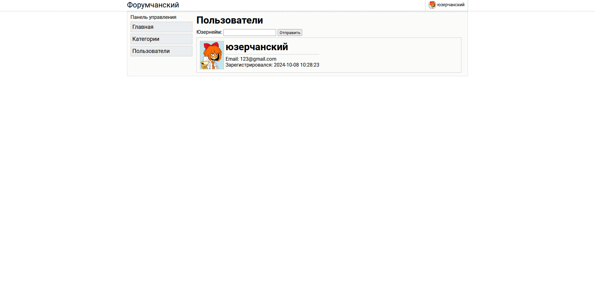

# Веб-форум на Go
Монолитный веб-форум, написанный на языке Go.

## Для чего?
Данный проект был создан для того, чтобы набить руку в программировании на данном языке.
Можно считать, что это "ядерный полигон" для всех моих хотелок.

## Функционал проекта
На данный момент на форуме реализовано:
- Главная страница, с последними 10-ю сообщениями, которые оставили участники форума.
- Категории, в которых можно писать топики.
- Сами топики, в которых люди могут выражать своё мнение в том или ином вопросе. Администраторам дана возможность удалять топики, а также по отдельности сообщения, которые там содержатся.
- Профили участников, в котором можно увидеть информацию о юзере, его последние сообщения.
- Небольшая админ-панель, в которой можно добавлять смотреть количество топиков/участников/сообщений, последних зарегистрировавшихся; категории; а также возможность изменять профили тех или иных участников.

## Как запустить?
Инструкция написана под операционную систему на базе Linux.
1) Сперва вы должны убедиться, что у вас установлен docker-compose:
   - ``apt update & apt upgrade & apt install docker-compose``
2) Загрузите данный репозиторий:
    - ``git clone https://github.com/tttttt30/web-forum``
3) Перейдите по пути `/web-forum/build/`:
    - ``cd /web-forum/build/``
4) Запустите компиляцию и запуск проекта, благодаря docker-compose:
    - ``docker-compose up -d``
5) После этого, у вас запустятся только 2 контейнера, поскольку не была загружена база данных. Поэтому, после запуска, прописываем:
   - ``docker exec -ti postgres psql -U postgres -h localhost -c 'create database "web-forum";'`` 
   - ``docker exec -ti postgres psql -U postgres -h localhost -f /usr/src/app/migrations/0001_table_initialize.sql web-forum``
6) Запустите остальные контейнеры:
   - ``docker-compose up -d``

## Админка
Чтобы получить права администратора, потребуется:
1) Зарегистрироваться на сайте.
2) Перейти в терминал Linux и ввести следующую команду:
   - ``docker exec -ti postgres psql -U postgres -h localhost -d 'web-forum' -c 'update users set is_admin = true where id = 1;'``

## Как выглядит дизайн:

